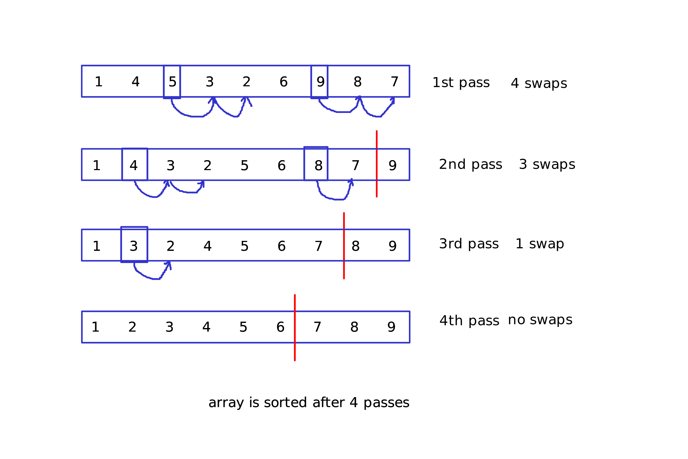
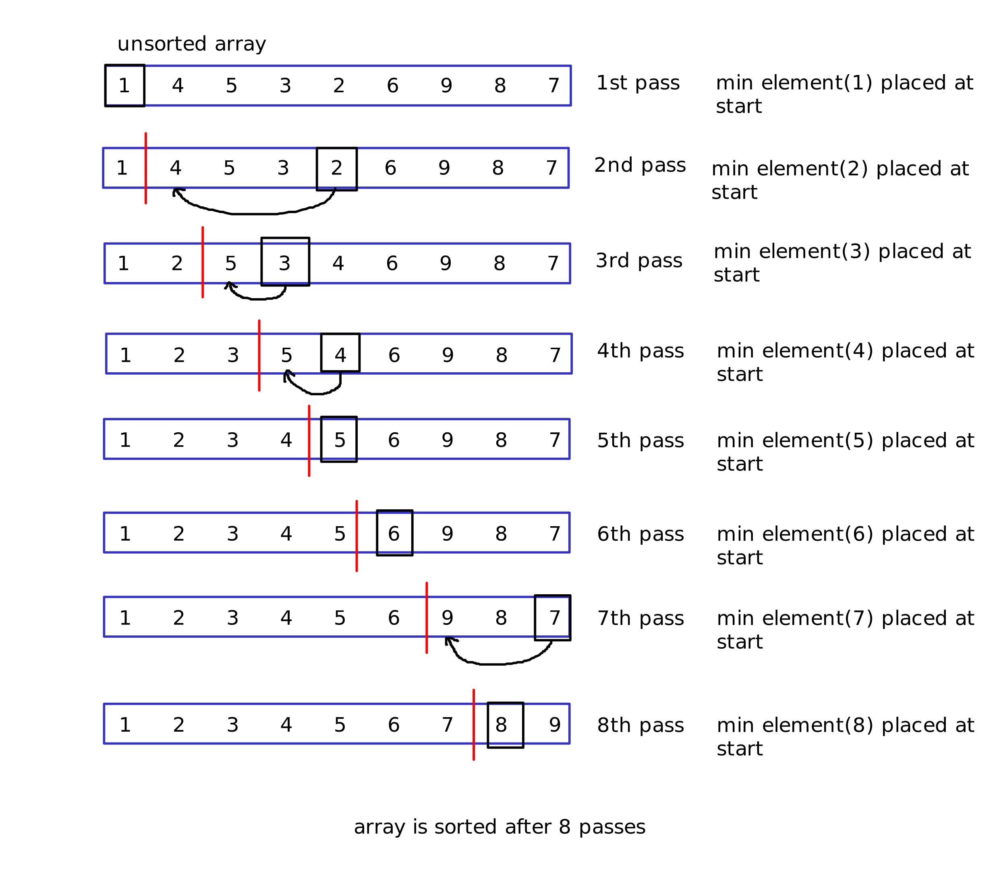

# Sorting algorithms
This is my repository where I implement a variety of sorting algorithms in Java.
I also keep notes in this README.md about time complexity and other notes about each algorithm.

Each visualization of an algorithm is created with [Xournal++](https://xournalpp.github.io/) and the source files are available in [visSrc](visSrc/) folder.
# Bubble sort
## Description :
Bubble sort is probably the simplest sorting algorithm, it involves swapping each adjacent element until the array is sorted. Each pass swaps an element with its adjacent one, if the element is greater than its adjacent one, so we end up with all the large elements at the end of the array, hence where the name "bubble" comes from, because the large elements "float" towards the end of the array like bubbles.
The array is sorted when no more swaps of adjacent elements are needed.
## Visualization :

## Time complexity :
O(n^2)
## Space complexity :
O(1) (Its an in-place algorithm)
## Implementation :
It is implemented in [BubbleSort.java](src/main/java/com/sorting/BubbleSort.java) with 2 methods, an optimized one and an unoptimized one.
The difference between the two is that the optimized method stops when there are no swaps done within a pass, while the unoptimized one continues until there are no passes left.
# Selection sort
## Description :
Selection sort is a sorting algorithm that sorts arrays by placing the smallest elements at the beginning, kind of the opposite of [Bubble sort](#bubble-sort). The algorithm start by finding the smallest element of the array, and places it at the beginning. The next pass, we find the smallest element again BUT we start looking from index 1, since index 0 is sorted. In subsequent passes, we do the exact same incrementing the range of our lookup for the minimum element by 1, that way the array gets sorted.
## Visualization :

## Time complexity :
O(n^2)
## Space complexity :
O(1)
## Implementation
Implemented with java in [SelectionSort.java](src/main/java/com/sorting/SelectionSort.java)